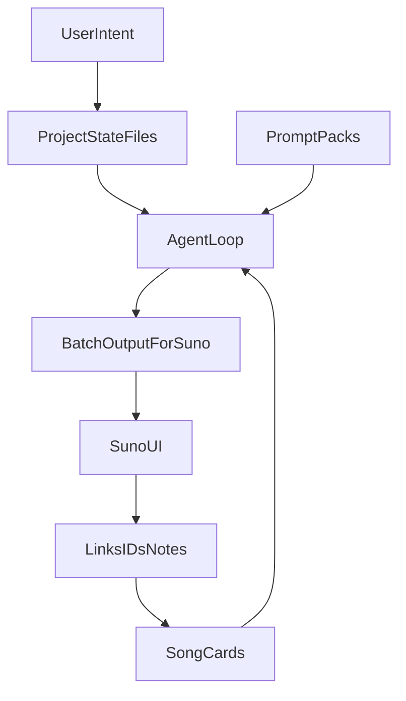

# SunoWell for Cursor System Design

SunoWell is a Markdown-based system for generating music prompts for Suno with consistency and iteration discipline.

It is intentionally similar to InkWell, but the unit of work is a song, and the output is copy/paste prompt batches.

---

## Design philosophy

### 1) English as code
The system logic is expressed as Markdown files. The files are the program.

### 2) External memory over internal memory
Agents do not "remember." They read project state and update it.

### 3) Recursive loop
The power comes from repeating:

load context → generate → self-check → update state → repeat

### 4) Controlled variation
Good music batches are not random. They vary within a palette.

SunoWell encodes the palette (style bible), the lyrical world (lyric bible), and the knobs that vary (cohesion kit).

---

## Architecture overview

### Layer 1: Behavioral core
- `AGENT-PLAYBOOK.md` defines the executable workflow for agents.

### Layer 2: Reusable modules (prompt packs)
- `prompt-packs/` contains recipe modules that can be reused across projects.

### Layer 3: Project state
- `projects/<name>/` contains the album or singles project state.

### Layer 4: Local state (song cards)
- `projects/<name>/songs/*.md` store track-level intent, prompts, and results notes.

---

## Why this solves the real Suno workflow problems

### Problem: prompt drift
You get a great track. Next day you cannot reproduce it.

Fix: the exact prompt and the exact constraints live in the song card and the batch log.

### Problem: album incoherence
Each track becomes a different genre by accident.

Fix: style bible + cohesion kit keep palette constant and vary only approved knobs.

### Problem: iteration amnesia
You forget which knob caused the improvement.

Fix: batch logs and pattern tracking make experiments explicit.

### Problem: "state of the art" rots
Suno changes.

Fix: `SUNO-VERSION.md` stores version assumptions and projects pin a snapshot in `PROJECT.md`.

---

## Data flow

---

## Core files (project)

- `PROJECT.md`: what we are making, constraints, and active packs
- `STYLE-BIBLE.md`: palette, tempo band, instrumentation, banned elements
- `LYRIC-BIBLE.md`: POV, themes, motif rules, language constraints
- `TRACKLIST.md`: arc and intent per track
- `BATCHES.md`: batches run, knobs changed, quick outcomes
- `PATTERN-TRACKING.md`: prevents sameness across an album
- `HANDOFF.md`: continuity between sessions
- `songs/*.md`: smallest unit of state

